## About Project

"PortfolioHub" is a web application built using the Laravel framework that serves as a personal portfolio for showcasing
your skills, projects, and professional experience. This platform allows you to present your achievements and expertise
in a visually appealing and user-friendly manner.

# Setups give you validate browse project

1) run XAMPP
2) git install https://github.com/Feras-Barahmeh/PortfolioHub/
3) cd <project name>
4) composer install
5) copy .env.example file and rename to .env
6) create db and change name in .env file
7) run command `php artisan mi:f --seed`
8) to generate app key run  `php artisan key:generate`
9) npm install
10) if it has a vulnerabilities errors run this `npm audit fix`
11) run `npm run dev; npm run build`
12) run `php artisan storage:link`
13) run `php artisan serve`
14) in browser got to `http://localhost:8000/en/login`

*Login As Admin*  

   | Privilege | Email           | Password |
      |-----------|-----------------|----------|
   | Admin     | admin@gmail.com | password |

# Packages

- Mcamara/localization
- astrotomic/laravel-translatable
- Laravel breeze
- Livewire
- CKEDITOR
- FilePond

# Snippet Images
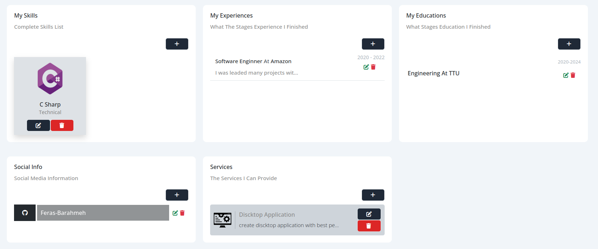
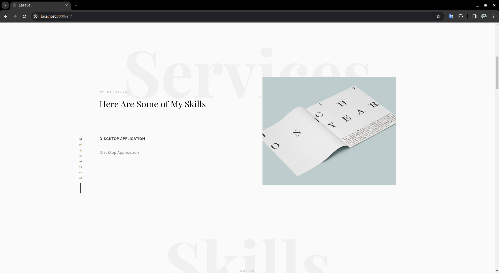
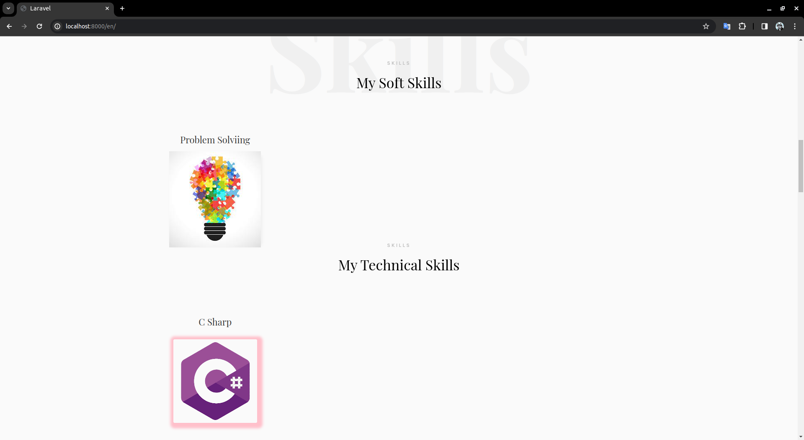
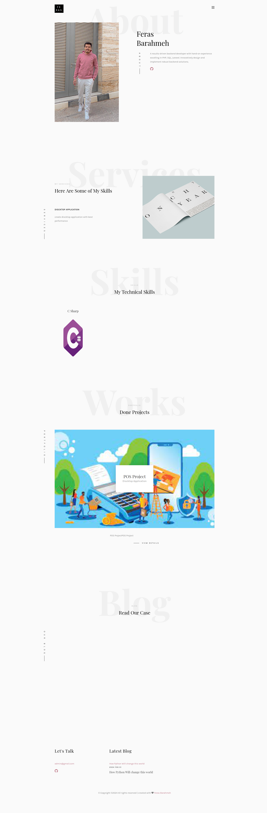
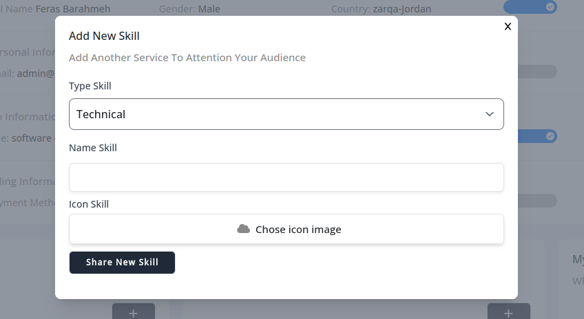
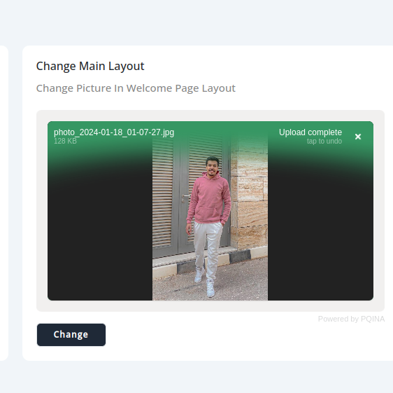
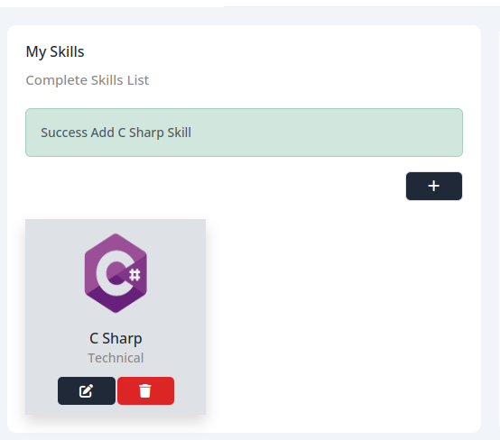
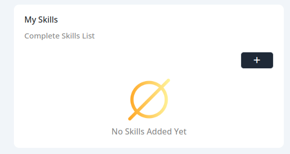
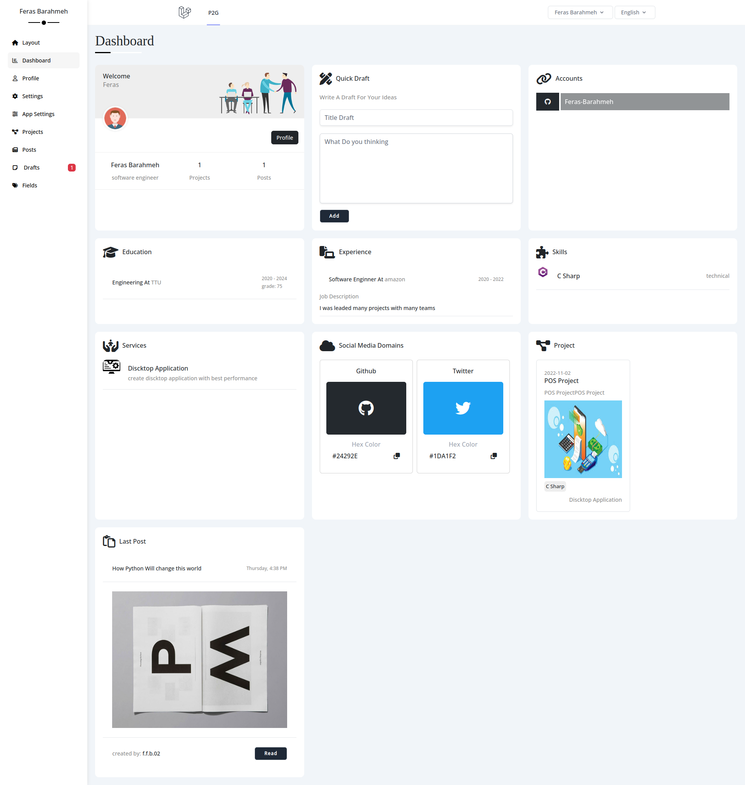
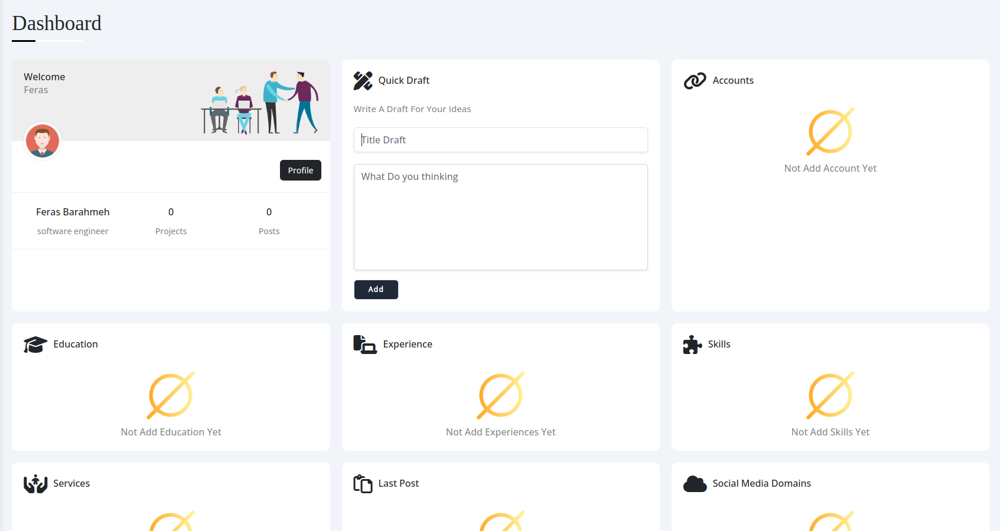
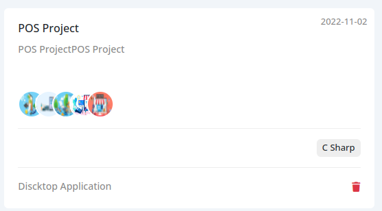
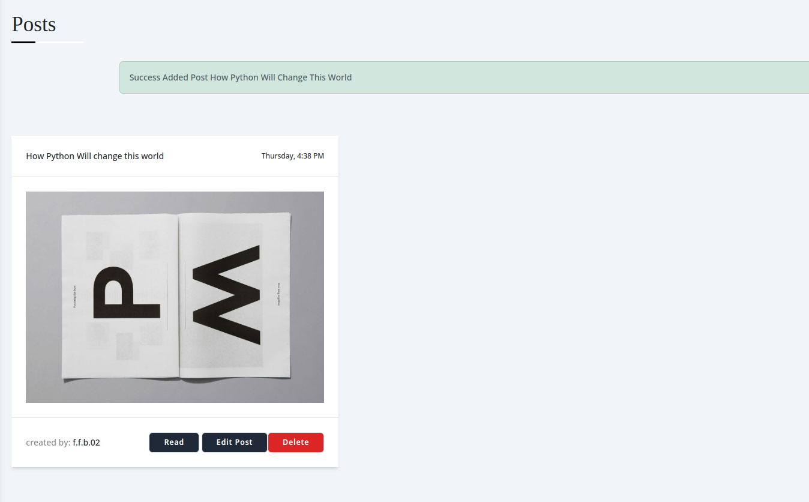
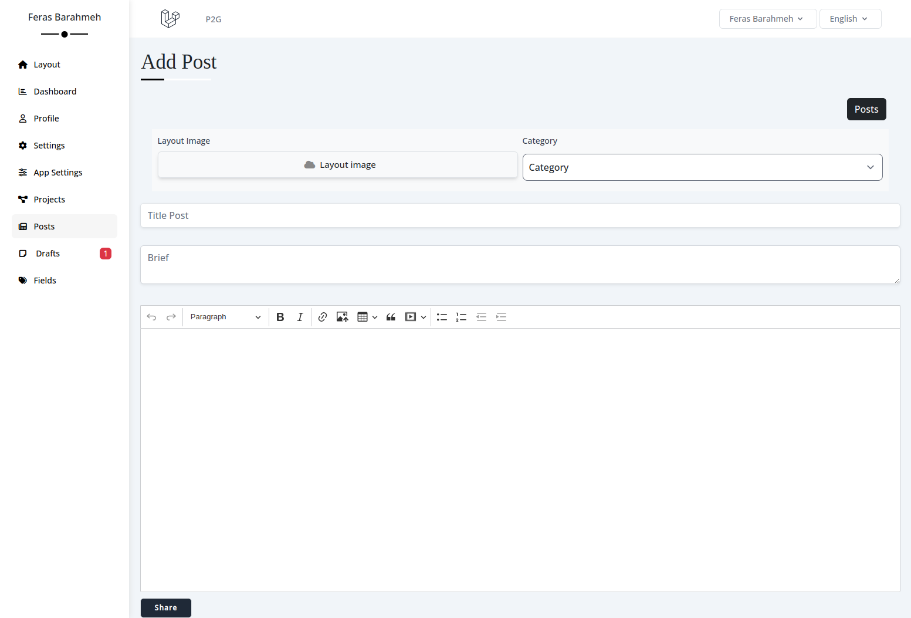
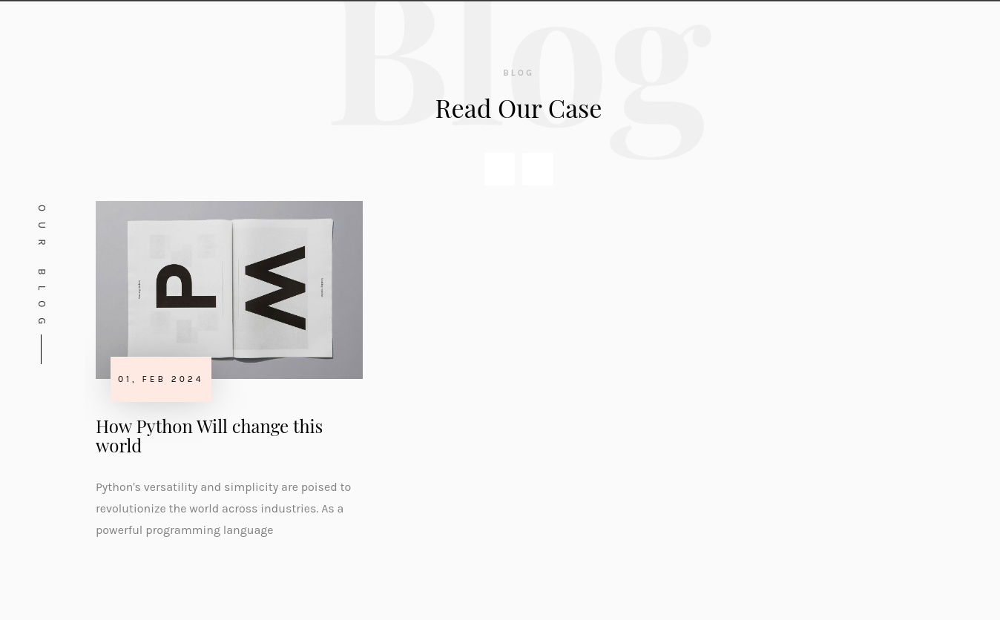
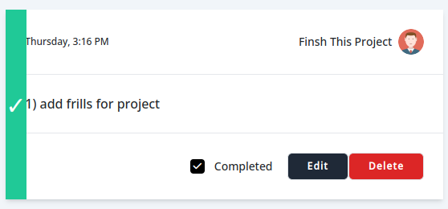
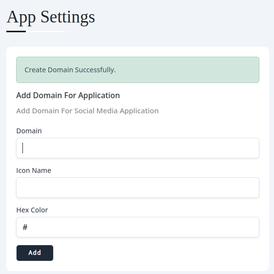
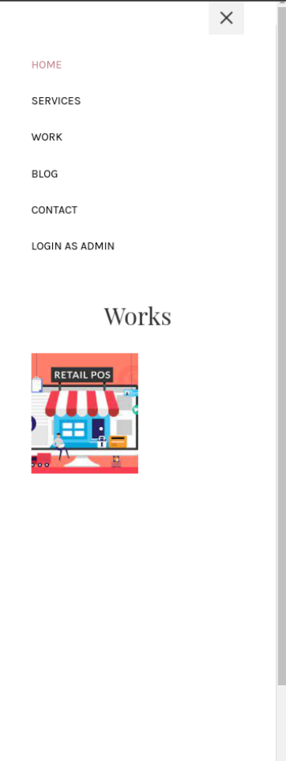
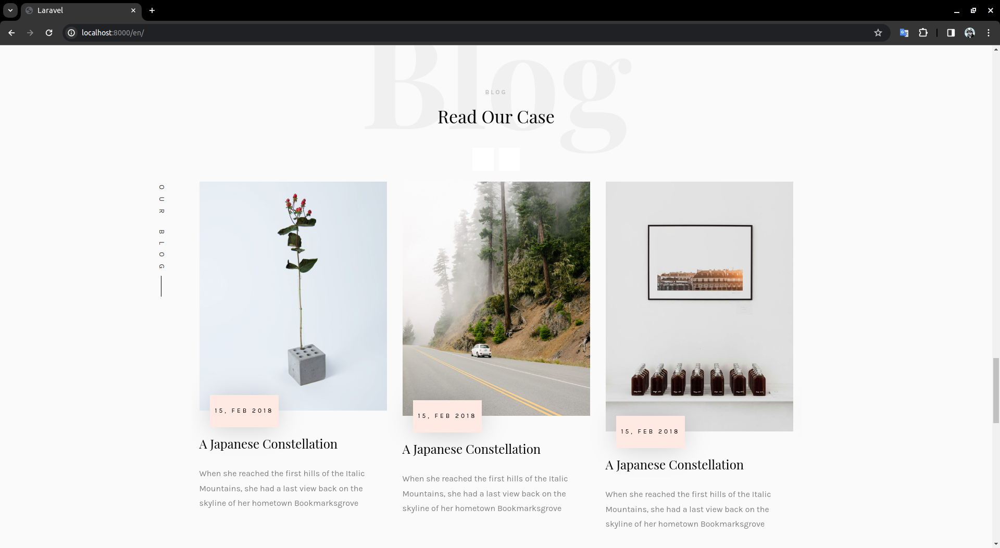
