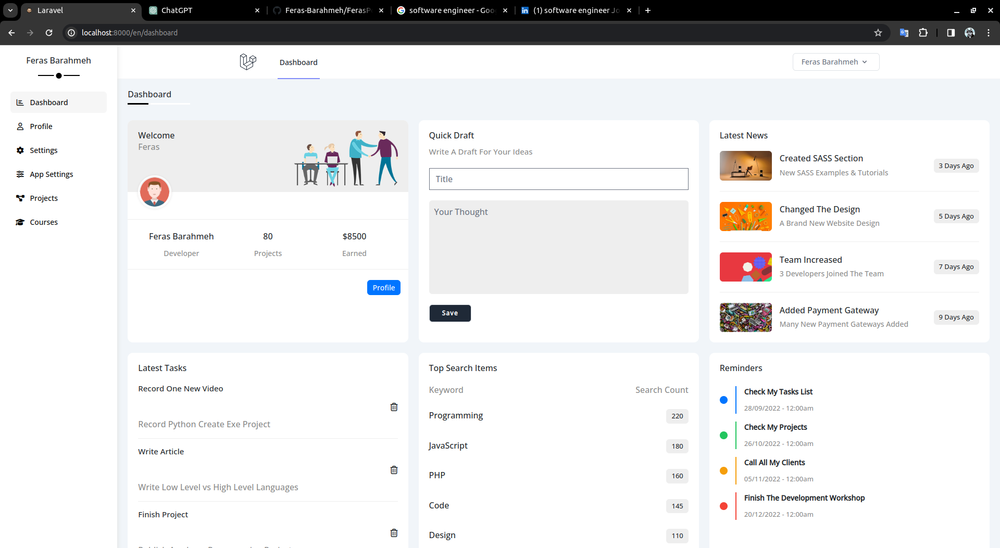
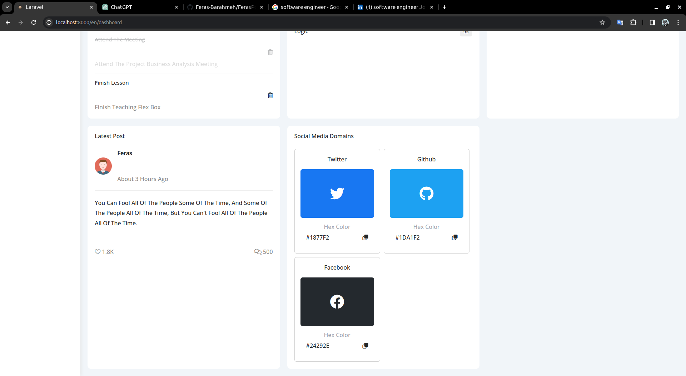
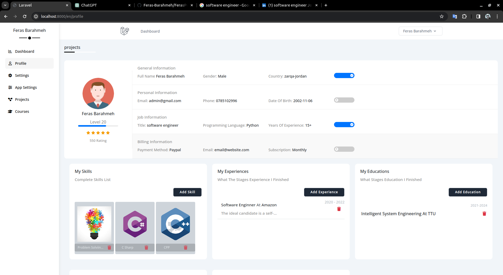
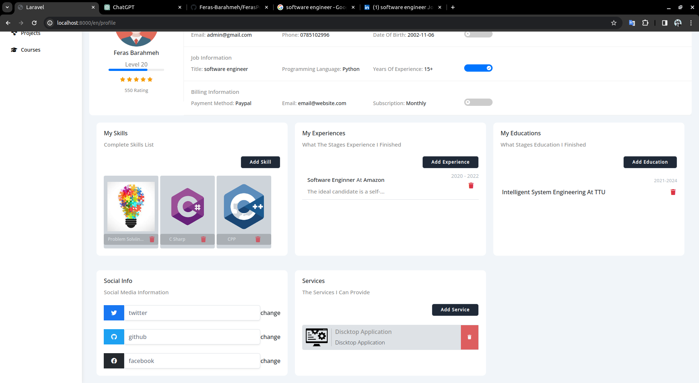
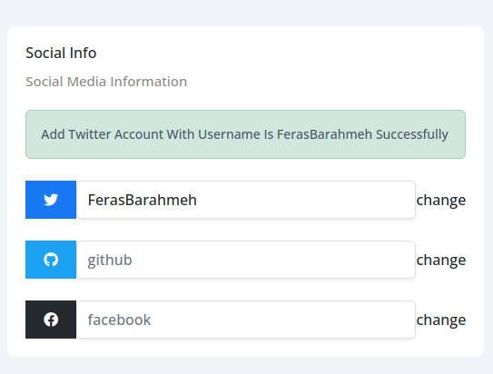
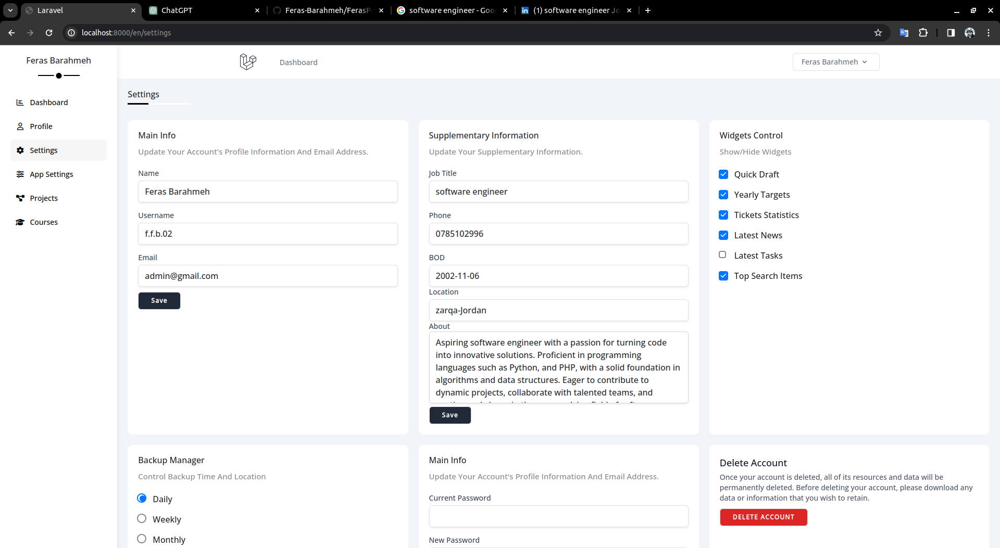
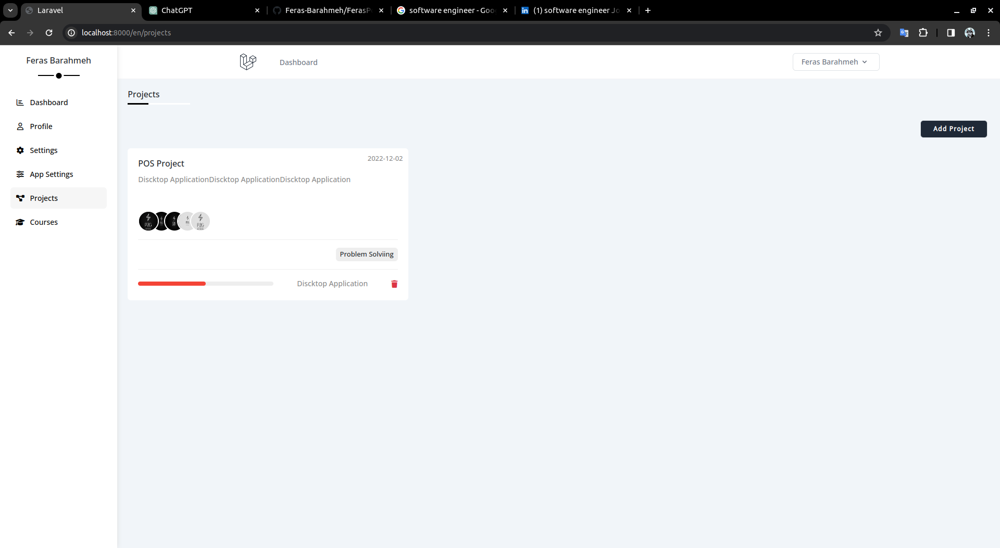
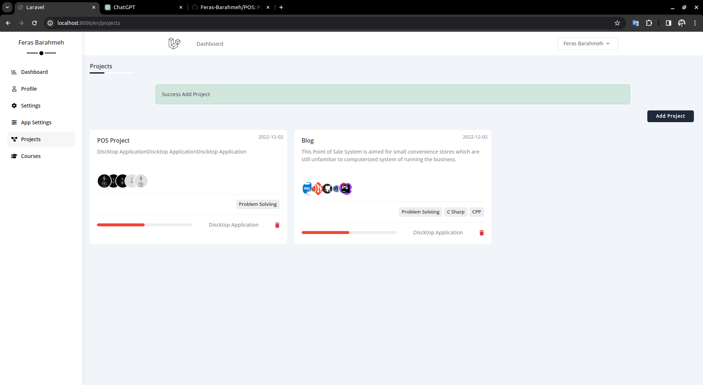

## About Project

"My Portfolio" is a web application built using the Laravel framework that serves as a personal portfolio for showcasing
your skills, projects, and professional experience. This platform allows you to present your achievements and expertise
in a visually appealing and user-friendly manner.

# How install it

1) git install https://github.com/Feras-Barahmeh/FerasPortfolio/
2) cd <project name>
3) composer install
4) install packages using in the project
5) create db and change name in .env file
6) php artisan migration:fresh --seed
7) http://localhost:8000/en/login

   | Privilege | Email           | Password |
      |-----------|-----------------|----------|
   | Admin     | admin@gmail.com | password |

# Packages

- Mcamara/localization
- astrotomic/laravel-translatable
- Laravel breeze
- Livewire
- CKEDITOR

# Snippet Images

